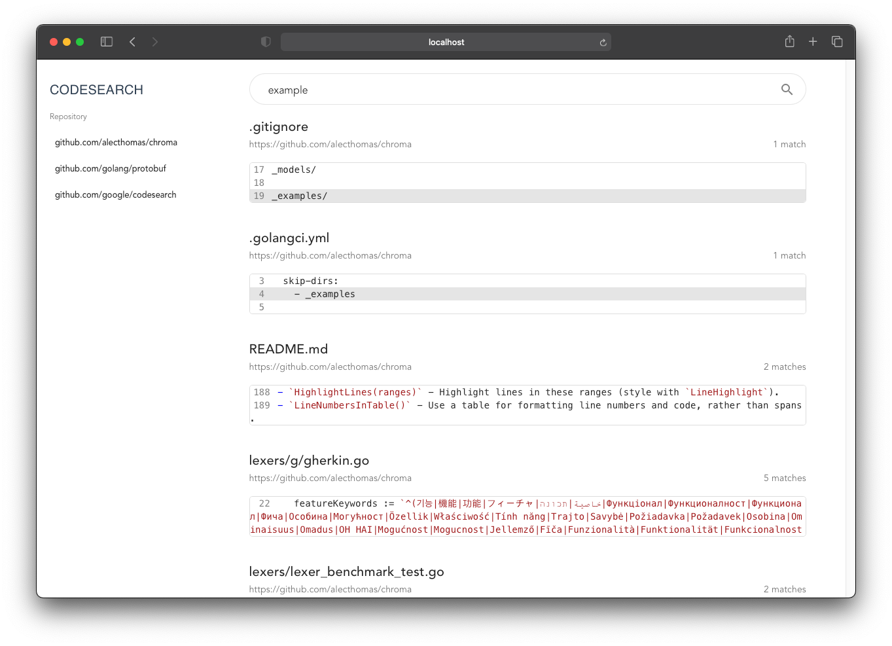

<h1 align="center">codesearch</h1>
<h3 align="center">A self-hosted git code search website, inspired by <a href="https://grep.app">grep.app</a>.</h3>



### Usage

To add a repository add a https url to the searchbar and an ingestion icon will appear.

### Installation

You can run codesearch from docker

```bash
docker run --publish 8000:8000 --volume=$PWD/cs:/db ghcr.io/cugu/codesearch:latest
```

or use any of the binaries https://github.com/cugu/codesearch/releases.

### Query

You can also query the underlying API directly:

``` bash
# Index data
curl -XPOST --data '{"url":"https://github.com/forensicanalysis/fslib"}' http://localhost:8080/index

# Search data
curl "http://localhost:8080/search?q=test"
```
